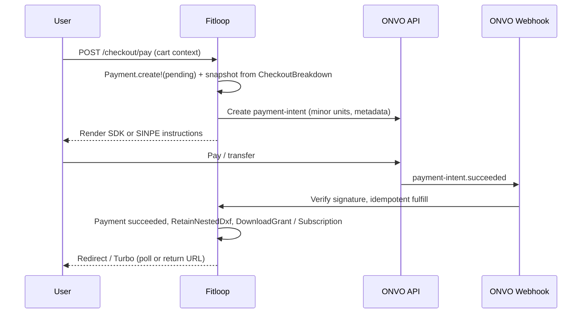

# Task: ONVO payments (live gateway)

**Status:** Spec locked — handoff to `start-task`  
**Roadmap:** `docs/ROADMAP.md` → Backlog → **ONVO payments (live gateway)**  
**REQ (target):** REQ-FIT-BILL-001, REQ-FIT-BILL-002 (extend); new ADR required (replaces ADR-0005 simulated-only)  
**Depends on:** Billing cart + MEIC UX merged to `main` (`add-cart` branch, 2026-05-28)  
**External gates (roadmap):** OT + ONVO sandbox account/keys  
**ONVO reference (local):** `onvo/indice-onvo.txt`, `onvo/docs-completa-onvo.txt` (mirror of https://docs.onvopay.com)

---

## Goal

Replace `Billing::SimulateSingleDownload` / `Billing::SimulatePlanPurchase` and demo success/fail buttons with **live ONVO** collection for:

- **CR:** CRC only — SINPE Móvil **or** tarjeta (`Billing::RegionalPolicy` already enforces this)
- **Fuera de CR:** USD only — tarjeta únicamente
- **Planes:** pago único (intent); sin renovación automática vía ONVO subscriptions

Preserve: cart snapshots, `Billing::CheckoutBreakdown` as SSOT for display amounts, `Payment` financial snapshots, `DownloadGrant` / plan entitlement on **confirmed** payment only.

---

## Current Fitloop baseline (post `add-cart`)

| Piece | Today |
|-------|--------|
| Checkout UI | `/checkout` — method-first, MEIC breakdown, simulate buttons |
| Fulfillment | Synchronous on simulate success: `Payment` + grant/subscription |
| `Payment` | No gateway IDs; `pending` \| `succeeded` \| `failed` |
| Amounts | `decimal` major units on `Payment`; cart uses `*_cents` integers |
| Kill list | `SYSTEM_ARCHITECTURE.md` — no live gateway until ADR |

**Regional rules (product, 2026-05-28):** CR → colones + SINPE/tarjeta; internacional → dólares + tarjeta. Alineado con `Billing::RegionalPolicy` (no USD para CR en política base).

---

## ONVO integration options (from `onvo/` docs)

### A — Payment Intents + Web SDK (roadmap wording)

**Server:** `POST /v1/payment-intents` (secret key), amount in **minor units**, `metadata` → `payment_id` / `cart_id`.  
**Client:** `https://sdk.onvopay.com/sdk.js` → `onvo.pay({ publicKey, paymentIntentId, paymentType: "one_time", ... })`.  
**SINPE:** Same intent flow; `payment-methods` type `mobile_number`; confirm → `processing`; fulfill on webhook `payment-intent.succeeded`.  
**Card:** SDK or server confirm with `paymentMethodId`; may hit `requires_action` (3DS).  
**Pros:** Keeps Fitloop checkout page + MEIC breakdown.  
**Cons:** Build SINPE UX (identification, instructions, polling/wait state).

### B — Hosted Checkout (one-time link / session)

**Server:** `POST /v1/checkout/sessions/one-time-link` with `lineItems`, `redirectUrl`, `cancelUrl`, `metadata`.  
**Client:** Redirect to ONVO `url`.  
**Fulfill:** `checkout-session.succeeded` webhook (or poll session).  
**Pros:** Faster to ship; ONVO owns payment UI.  
**Cons:** Leaves Fitloop checkout / MEIC line items unless duplicated on ONVO side; weaker control of method-first UX.

### C — Hybrid

Card via SDK on `/checkout`; SINPE via intent + custom instructions (same as A for SINPE).

**Product decision (2026-05-28):** **A/C — Payment Intents + SDK embebido** en `/checkout` (no redirect a Checkout hospedado). ONVO documenta ambas vías; Fitloop conserva breakdown MEIC en nuestra página.

**ONVO docs — no impone una sola vía:**
- **Checkout hospedado:** “salir rápido”, delegar UI, redirect + webhook `checkout-session.succeeded`.
- **Intents + SDK / API:** flujo “Primeros pasos” (crear intent → confirmar → webhooks); SDK embebe formulario en tu sitio.
- **Buena práctica ONVO:** confirmar éxito por **webhook** antes de entregar bienes digitales (aplica a ambos).

---

## Recommended fulfillment model (webhook-first)

ONVO explicitly: **do not** mark paid / deliver digital goods until webhook (or verified terminal intent state).



**Idempotency:** `Payment` row keyed by internal id in `metadata`; webhook handler no-ops if already `succeeded`.

**User return:** SDK `onSuccess` / `returnUrl` (3DS) → show “processing” until webhook or poll `GET payment-intent` — **not** immediate grant (replaces simulate).

---

## Domain model (approved 2026-05-28)

### Payment (extended)

- **Responsibility:** Internal order record + immutable MEIC snapshot (unchanged).
- **Invariants:**
  - `pending` may have at most one **open** ONVO intent per payment (reuse same intent id until terminal).
  - `succeeded` only after gateway confirmation (webhook authoritative; client poll is UX only).
  - `gateway_provider == "onvo"` when live (nullable for legacy simulated rows).
- **Fields:** `gateway_provider`, `onvo_payment_intent_id`, `onvo_mode` (`test` | `live`), `gateway_status`, `failure_code`, `failure_message`.

### Billing::Onvo::PaymentIntentId (value object)

- Wraps external ONVO payment intent id; validated non-blank; not a raw `String` in service boundaries.

### Billing::Onvo::MoneyMinorUnits (value object)

- Converts `Billing::CheckoutBreakdown#total_amount` (major `decimal`) → integer minor units for ONVO (`CRC` | `USD`).
- Single factory: `.from_breakdown(breakdown)`; no ad-hoc cent math in controllers.

### Billing::Onvo::WebhookEvent (value object)

- Parses inbound payload: `type`, `data.id`, optional `onvo_event_id`.
- Dedupe key for idempotent `HandleWebhookEvent` (event id or stable hash).

### Services (names locked for plan)

- `Billing::Onvo::Client`, `CreatePaymentIntent`, `VerifyWebhook`, `HandleWebhookEvent`
- `Billing::FulfillPayment`, `Billing::FailPayment` (shared with simulate paths)

---

## Mapping Fitloop ↔ ONVO

| Fitloop | ONVO |
|---------|------|
| `card_usd` / `card_crc` | Payment intent `currency` USD/CRC + card method |
| `sinpe_crc` | Intent CRC + `mobile_number` payment method |
| Cart `list_price_cents` / breakdown | Intent `amount` = `total` in minor units (after discount + IVA) |
| Plan 1/2/4m purchase | **One-time intent** (not ONVO `subscriptions` unless product wants recurring) |
| IVA 13% CR | Included in intent amount; ONVO does not calculate IVA for us |

**Plans note:** Fitloop “subscription” is **prepaid term + monthly download quota**, not card-on-file recurring. ONVO **subscriptions** API is likely **out of scope** v1 — use one-time intents per plan checkout (matches cart today).

---

## Closed questions (product answers 2026-05-28)

| ID | Answer |
|----|--------|
| Q-UX-PATTERN | **Intents + SDK embebido** (ver sección ONVO docs arriba) |
| Q-PLAN-RECURRING | **Solo pago único**; sin suscripciones ONVO para auto-renovar |
| Q-REFUNDS | **Fuera de alcance v1** — solo pagos exitosos y fallidos |
| Q-SANDBOX | **Sí** — integrar primero en **modo test** (`onvo_test_*` keys); cuenta ONVO del equipo disponible |
| Q-REGIONAL | CR = CRC + SINPE/tarjeta; fuera CR = USD + tarjeta |

## Closed questions (product + architect 2026-05-28, round 2)

| ID | Decision |
|----|----------|
| Q-UX-PATTERN | **Intents + SDK embebido** (recomendación aceptada — mejor encaje MEIC/regional) |
| Q-POLLING | **Webhook = verdad** para entregar DXF/plan; **UX = pantalla “Procesando…”** con poll cada **2–3 s**, máx **~60 s** (más user-friendly que “refrescá vos”) |
| Q-POLL-TIMEOUT | Si 60 s sin `succeeded`: mensaje “Estamos confirmando tu pago; revisá Mis pagos en unos minutos” — webhook puede completar en background |
| Q-3DS-RETURN | **`/checkout/retorno`** (o equivalente bajo rutas ES) — aceptado |
| Q-SINPE-FIELDS | **Sí** — cédula + teléfono móvil del transferente en checkout (ONVO `mobile_number`) |
| Q-WEBHOOK-DEV | **Primario: staging** con URL HTTPS fija en dashboard ONVO; **opcional:** ngrok solo para spike local (ver nota abajo) |
| Q-ENV-STORAGE | **ENV en deploy** (`ONVO_SECRET_KEY`, `ONVO_PUBLISHABLE_KEY`, `ONVO_WEBHOOK_SECRET`, `ONVO_MODE=test\|live`) — alineado con OAuth Devise; local vía `.env` gitignored o secrets del host; **no** commitear llaves |

### Webhooks en desarrollo (nota para el equipo)

ONVO envía webhooks desde internet → tu app debe tener una **URL pública HTTPS**. `localhost:3000` no es alcanzable desde afuera.

| Modo | Cómo |
|------|------|
| **Ahora (usuario)** | **ngrok** → `https://xxxx.ngrok-free.app/webhooks/onvo` en dashboard ONVO test (URL cambia si reiniciás ngrok salvo plan fijo) |
| **Después** | Northflank staging fijo (misma ruta, URL estable) |

### Poll UX (por qué es más amigable)

| Enfoque | Experiencia |
|---------|-------------|
| Solo webhook, usuario refresca | Ansiedad, doble clic, soporte |
| Webhook + “Procesando…” + poll corto | Feedback inmediato; entrega automática al confirmar |

### Secrets layout (recomendado)

```yaml
# Producción/staging — variables de entorno (Kamal/DEPLOY)
ONVO_MODE=test                    # luego live
ONVO_SECRET_KEY=onvo_test_secret_...
ONVO_PUBLISHABLE_KEY=onvo_test_publishable_...
ONVO_WEBHOOK_SECRET=whsec_...     # verificar firma webhook
```

- **Secret + webhook secret:** solo servidor.
- **Publishable:** puede ir al layout checkout (como Stripe publishable).
- **Credentials.yml:** alternativa válida si el equipo prefiere un solo archivo cifrado; Fitloop ya usa **ENV para OAuth** → consistencia con ENV.

## Open questions (remaining)

| ID | Question |
|----|----------|
| Q-STAGING-URL | **ngrok verificado 2026-05-28:** `https://barbecue-filing-getting.ngrok-free.dev` → `:3000`, `config.hosts` OK, home Fitloop visible tras “Visit Site”. Webhook: `…/webhooks/onvo` (endpoint pendiente implementación) |
| Q-SPEC-LOCK | **Closed 2026-05-28** — `<implementation_plan>` below |

---

## Risks

| Risk | Mitigation |
|------|------------|
| Double fulfillment (client + webhook) | Single `Billing::FulfillPayment` service; idempotent |
| Amount mismatch (cents vs colones) | Unit test conversion; intent amount from `CheckoutBreakdown` only |
| SINPE identification mismatch | Collect `identification` + `mobileNumber` on checkout; copy ONVO test numbers in sandbox |
| User closes tab while `processing` | Webhook still fulfills; email? (out of scope?) |
| Simulated code paths in production | Feature flag `BILLING_GATEWAY=simulate\|onvo`; remove demo buttons when `onvo` |

---

## Out of scope (this epic)

- ONVO coupons / BIN rules (MEIC already in Fitloop pricing)
- Billing domain types CbC refactor (separate roadmap item)
- Admin ventas UI (depends on snapshots — can ship before/parallel)
- Real legal copy (FU-LEGAL)
- PCI: card data stays in ONVO SDK/tokenization

---

## Artifacts to produce before `start-task`

1. **ADR-0006** — ONVO gateway, webhook contract, env vars, kill-list update  
2. **SPEC** — Replace “simulated checkout” with ONVO flows; keep MEIC/cart rules  
3. **`SYSTEM_ARCHITECTURE.md`** — Billing row + kill list  
4. **Env:** `ONVO_SECRET_KEY`, `ONVO_PUBLISHABLE_KEY`, `ONVO_WEBHOOK_SECRET`, mode test/live  

---

## Scratchpad

- Local ONVO bundle is ~3.3k lines — good for offline agent context; keep `onvo/` as vendor docs (not committed secrets).
- `indice-onvo.txt` = llms-style index; prefer `docs-completa-onvo.txt` for full text search.
- Webhook events: `payment-intent.succeeded`, `payment-intent.failed`, `payment-intent.deferred`.
- SINPE test numbers: `/payments/testing#sinpe-móvil` section in bundle.

---

## Decision log

| Date | ID | Decision |
|------|-----|----------|
| 2026-05-28 | D-ONVO-01 | Discovery opened; source docs = `onvo/` folder |
| 2026-05-28 | D-ONVO-02 | Webhook-first fulfillment (ONVO best practice) |
| 2026-05-28 | D-ONVO-03 | Payment Intents + SDK embebido; plans = one-time intents |
| 2026-05-28 | D-ONVO-04 | Sin reembolsos v1; solo succeeded/failed |
| 2026-05-28 | D-ONVO-05 | Integración primero `onvo_test_*`; cuenta ONVO disponible |
| 2026-05-28 | D-ONVO-06 | CR=CRC+SINPE/card; intl=USD+card only (confirma RegionalPolicy) |
| 2026-05-28 | D-ONVO-07 | UX poll 2–3s / 60s + webhook authoritative |
| 2026-05-28 | D-ONVO-08 | SINPE: cédula + móvil en checkout |
| 2026-05-28 | D-ONVO-09 | Webhooks dev → staging HTTPS; ngrok opcional |
| 2026-05-28 | D-ONVO-10 | ONVO keys vía ENV (patrón OAuth); .env local gitignored |
| 2026-05-28 | D-ONVO-11 | 3DS return `/checkout/retorno` |
| 2026-05-28 | D-ONVO-12 | Staging ONVO → **Northflank** (cuenta/servicio del equipo) |
| 2026-05-28 | D-ONVO-14 | Webhook dev primero con **ngrok**; Northflank cuando haya URL fija |
| 2026-05-28 | D-ONVO-13 | Northflank v1 scope: billing/webhooks only; nesting E2E container = follow-up deploy |

### Northflank staging (ops checklist)

1. Servicio web desde `Dockerfile` (Rails 8 + Thruster puerto 80).
2. Addon **PostgreSQL**; `DATABASE_URL` / vars `PG*`; `bin/rails db:prepare` en deploy.
3. Dominio Northflank HTTPS (ej. `https://fitloop-staging-xx.northflank.app`) → registrar `…/webhooks/onvo` en ONVO test.
4. ENV: `RAILS_MASTER_KEY`, `SECRET_KEY_BASE`, `ONVO_*`, `RAILS_ENV=production`.
5. **Nesting:** imagen actual no incluye Python/`nesting_engine` — **aceptado (2026-05-28):** staging Northflank v1 = **billing + webhooks only**; taller E2E (DXF → nest → pay → download) = **follow-up deploy** (ampliar imagen / worker Python).

### Staging scope v1 (Northflank)

| In scope (ONVO epic) | Out of scope v1 (follow-up) |
|----------------------|-----------------------------|
| `/checkout`, SDK, SINPE fields, poll UX | Nesting job en contenedor |
| `POST /webhooks/onvo`, fulfill `Payment` | Upload DXF + nest real en staging |
| `Payment` / cart / plans simulate → live | Golden E2E nesting en Northflank |
| Mis pagos, grants (datos seed o fixtures) | `nesting_engine` en Dockerfile |

**Test strategy on staging:** request specs + pagos ONVO test; datos vía seeds/fixtures (`NestingRun` + paywall) sin correr CLI Python en el host.

---

<implementation_plan>
  <meta>
    <task_slug>onvo-payments</task_slug>
    <branch_name_suggestion>feat/onvo-payments</branch_name_suggestion>
    <roadmap_item>ONVO payments (live gateway)</roadmap_item>
    <classification>Feature</classification>
    <req_ids>
      <req>REQ-FIT-BILL-001</req>
      <req>REQ-FIT-BILL-002</req>
      <req>REQ-FIT-BILL-003</req>
    </req_ids>
    <constraints>
      <constraint>ADR-0006 required before production ONVO paths; updates SYSTEM_ARCHITECTURE kill list (replaces simulated-only).</constraint>
      <constraint>Rails-only billing; no payment logic in Python.</constraint>
      <constraint>CheckoutBreakdown SSOT for amounts; ONVO intent amount = breakdown total in minor units (CRC/USD).</constraint>
      <constraint>RegionalPolicy: CR → CRC + SINPE|card; non-CR → USD + card only.</constraint>
      <constraint>Webhook authoritative for fulfillment (DownloadGrant / Subscription / RetainNestedDxf); idempotent.</constraint>
      <constraint>Payment Intents + embedded SDK; no ONVO hosted Checkout redirect; no ONVO subscriptions API.</constraint>
      <constraint>No refunds v1; succeeded + failed only.</constraint>
      <constraint>ENV: ONVO_MODE, ONVO_SECRET_KEY, ONVO_PUBLISHABLE_KEY, ONVO_WEBHOOK_SECRET; BILLING_GATEWAY=simulate|onvo.</constraint>
      <constraint>Dev webhooks via ngrok (`config.hosts` for *.ngrok-free.dev); Northflank staging follow-up.</constraint>
      <constraint>Reference: `onvo/docs-completa-onvo.txt`, https://docs.onvopay.com</constraint>
    </constraints>
    <dev_webhook_url>https://barbecue-filing-getting.ngrok-free.dev/webhooks/onvo</dev_webhook_url>
    <manual_qa_sinpe>docs/QA_ONVO_SINPE.md</manual_qa_sinpe>
  </meta>

  <phase id="P0" name="Anchors &amp; configuration">
    <step id="0.1" status="complete">Write failing spec (or extend `auth_billing_spec_doc_test`) asserting SPEC/ADR mention ONVO live checkout, webhook fulfillment, and BILL-001 simulated section updated.</step>
    <step id="0.2" status="complete">Add `docs/core/ADRs/0006-onvo-live-billing.md` (supersedes simulated-only in ADR-0005 for payment capture; ENV; webhook `X-Webhook-Secret`; events `payment-intent.succeeded|failed`).</step>
    <step id="0.3" status="complete">Update `docs/core/SPEC.md` REQ-FIT-BILL-001 detail: ONVO intents + SDK, SINPE fields, processing poll UX, webhook-first; keep cart/MEIC rules.</step>
    <step id="0.4" status="complete">Update `docs/core/SYSTEM_ARCHITECTURE.md` billing row + remove ONVO from kill list when ADR-0006 accepted.</step>
    <step id="0.5" status="complete">Extend `.env.example` with commented `ONVO_*` and `BILLING_GATEWAY`; add `docs/DEPLOY.md` subsection: ngrok webhook dev (URL, restart caveat, inspector :4040).</step>
  </phase>

  <phase id="P1" name="Payment gateway persistence">
    <step id="1.1" status="complete">Write failing model spec: `Payment` accepts `gateway_provider`, `onvo_payment_intent_id`, `onvo_mode`, `gateway_status`; pending allows nil `paid_at`; succeeded requires gateway confirmation path.</step>
    <step id="1.2" status="complete">Migration: add gateway columns to `payments` (string fields, index on `onvo_payment_intent_id`).</step>
    <step id="1.3" status="complete">Implement model validations/enums minimal for gateway state mirror.</step>
  </phase>

  <phase id="P2" name="ONVO API client &amp; money">
    <step id="2.1" status="complete">Write failing unit specs for `Billing::Onvo::MoneyMinorUnits.from_breakdown` (CRC/USD major → integer minor per ONVO rules).</step>
    <step id="2.2" status="complete">Implement `Billing::Onvo::Client` (Faraday/Net::HTTP): create payment intent, get intent, create/confirm payment method stubs; reads ENV; `mode` from `ONVO_MODE`.</step>
    <step id="2.3" status="complete">Write failing spec: `Billing::Onvo::CreatePaymentIntent` builds payload from `CheckoutBreakdown` + `metadata: { payment_id }`.</step>
    <step id="2.4" status="complete">Implement `CreatePaymentIntent` service.</step>
  </phase>

  <phase id="P3" name="Webhook (authoritative fulfillment)">
    <step id="3.1" status="complete">Write failing request spec: `POST /webhooks/onvo` with valid `X-Webhook-Secret` + `payment-intent.succeeded` marks `Payment` succeeded and creates `DownloadGrant` (single_download fixture).</step>
    <step id="3.2" status="complete">Write failing request spec: invalid/missing secret → 401; duplicate webhook → 200 idempotent no double grant.</step>
    <step id="3.3" status="complete">Add route `post "/webhooks/onvo"` (skip CSRF); `Webhooks::OnvoController#create`.</step>
    <step id="3.4" status="complete">Implement `Billing::Onvo::VerifyWebhook` + `Billing::Onvo::HandleWebhookEvent` delegating to `Billing::FulfillPayment` / `Billing::FailPayment`.</step>
  </phase>

  <phase id="P4" name="Fulfillment extraction">
    <step id="4.1" status="complete">Write failing service specs for `Billing::FulfillPayment` (single_download + plan_subscription) mirroring current simulate success invariants (retain nested DXF, grant, subscription extension, snapshots).</step>
    <step id="4.2" status="complete">Extract shared logic from `SimulateSingleDownload` / `SimulatePlanPurchase` into `FulfillPayment` / `FailPayment`; simulators call same services on success/failure.</step>
  </phase>

  <phase id="P5" name="Checkout — start payment (replace simulate when onvo)">
    <step id="5.1" status="complete">Write failing request spec: `BILLING_GATEWAY=onvo` POST checkout pay creates `Payment` pending + returns intent id (no grant yet).</step>
    <step id="5.2" status="complete">Add `CheckoutController#pay` (or rename flow): create pending `Payment` from cart + `CheckoutBreakdown`; call `CreatePaymentIntent`; store `onvo_payment_intent_id`.</step>
    <step id="5.3" status="complete">Remove/hide simulate success/fail buttons when `Billing::Gateway.onvo?`; keep simulate behind `BILLING_GATEWAY=simulate` for dev fallback.</step>
  </phase>

  <phase id="P6" name="Checkout UI — card SDK &amp; SINPE">
    <step id="6.1" status="complete">Write system/request spec skeleton: checkout renders ONVO SDK container when card selected (stub SDK).</step>
    <step id="6.2" status="complete">Add Stimulus `onvo_checkout_controller`: load `sdk.onvopay.com`, `onvo.pay({ publicKey, paymentIntentId, paymentType: "one_time", onSuccess, onError })`.</step>
    <step id="6.3" status="complete">SINPE branch: form cédula + teléfono móvil; server creates `mobile_number` payment method + confirms intent; show ONVO destination number + exact amount instructions.</step>
    <step id="6.4" status="complete">i18n `billing.checkout.onvo.*` (+ `es_panic` parity); fraud monitoring note per ONVO doc if required.</step>
  </phase>

  <phase id="P7" name="Processing UX (poll + timeout)">
    <step id="7.1" status="complete">Write failing request spec: `GET /checkout/pagos/:payment_id/estado` returns JSON `{ status }` from DB (not grant until succeeded).</step>
    <step id="7.2" status="complete">Add `checkout/processing` view + Stimulus poll every 2–3s, max 60s; on succeeded redirect per today (mis_pagos / workshop); on timeout show “confirmando…” copy.</step>
    <step id="7.3" status="complete">`onSuccess` SDK → redirect to processing (do not fulfill client-side).</step>
  </phase>

  <phase id="P8" name="3DS return">
    <step id="8.1" status="complete">Write failing request spec: `GET /checkout/retorno?payment_intent_id=` redirects to processing when intent requires_action completed.</step>
    <step id="8.2" status="complete">Implement `CheckoutController#return` route; reconcile intent via `Billing::Onvo::Client#get_intent`.</step>
  </phase>

  <phase id="P9" name="SINPE confirm &amp; failure paths">
    <step id="9.1" status="complete">Write failing webhook spec: `payment-intent.failed` → `Payment.failed` with snapshot preserved.</step>
    <step id="9.2" status="complete">Manual QA notes: ONVO test SINPE numbers from `onvo/docs-completa-onvo.txt` testing section.</step>
  </phase>

  <phase id="P10" name="Regression &amp; docs">
    <step id="10.1" status="complete">Run full billing request spec suite; tag new files `[REQ-FIT-BILL-001]` on root `RSpec.describe`.</step>
    <step id="10.2" status="complete">Update `docs/QA_MANUAL_CHECKLIST.md`: ONVO test card, SINPE test flow, ngrok webhook, processing screen.</step>
    <step id="10.3" status="pending">Update `docs/ROADMAP.md` ONVO item when merged; note Northflank + full Docker nesting as follow-up.</step>
  </phase>
</implementation_plan>
